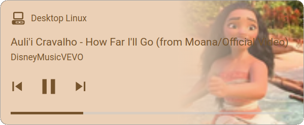

# 🎬 Media Player

MQTT integration for a media player is not supported by home assistant, so a custom addon must be installed using HACS. I've modified an addon called [mqtt-mediaplayer](https://github.com/bkbilly/hass-mqtt-mediaplayer) for creating a new media\_player entity.

[](https://my.home-assistant.io/redirect/hacs\_repository/?owner=bkbilly\&repository=hass-mqtt-mediaplayer\&category=integration)

This addon gets the information from the attributes of media\_info sensor. It supports playing remote or local media using `cvlc` which should be installed on your system.

<div align="left">

<figure><figcaption></figcaption></figure>

</div>

Add this yaml block on your configuration.yaml file and restart Home Assistant.

```yaml
media_player:
  - platform: mqtt-mediaplayer
    name: "Desktop Linux"
    status_keyword: "true"
    topic:
      song_title: "{{ state_attr('sensor.desktop_linux_media_info', 'title') }}"
      song_artist: "{{ state_attr('sensor.desktop_linux_media_info', 'artist') }}"
      song_album: "{{ state_attr('sensor.desktop_linux_media_info', 'album') }}"
      song_volume: "{{ state_attr('sensor.desktop_linux_media_info', 'volume') }}"
      player_status: "{{ state_attr('sensor.desktop_linux_media_info', 'status') }}"
      track_duration: "{{ state_attr('sensor.desktop_linux_media_info', 'duration') }}"
      track_position: "{{ state_attr('sensor.desktop_linux_media_info', 'position') }}"
      album_art: "lnxlink/desktop-linux/monitor_controls/media_info/thumbnail"
      volume:
        service: mqtt.publish
        data:
          topic: "lnxlink/desktop-linux/commands/media/volume_set"
          payload: "{{volume}}"
    next:
      service: mqtt.publish
      data:
        topic: "lnxlink/desktop-linux/commands/media/next"
        payload: "ON"
    previous:
      service: mqtt.publish
      data:
        topic: "lnxlink/desktop-linux/commands/media/previous"
        payload: "ON"
    play_media:
      service: mqtt.publish
      data:
        topic: "lnxlink/desktop-linux/commands/media/play_media"
        payload: "{{media}}"
    play:
      service: mqtt.publish
      data:
        topic: "lnxlink/desktop-linux/commands/media/playpause"
        payload: "ON"
    pause:
      service: mqtt.publish
      data:
        topic: "lnxlink/desktop-linux/commands/media/playpause"
        payload: "ON"
```

### Text To Speech

```yaml
service: tts.google_say
data:
  entity_id: media_player.desktop_linux
  message: Hello world!
```

### Play Media

```yaml
service: media_player.play_media
data:
  media_content_id: /home/user/imag.jpg
  media_content_type: media  # Not used, but required by home assistant
target:
  entity_id: media_player.desktop_linux
```

### Stream Camera

```yaml
service: camera.play_stream
data:
  media_player: media_player.desktop_linux
target:
  entity_id: camera.demo_camera
```
